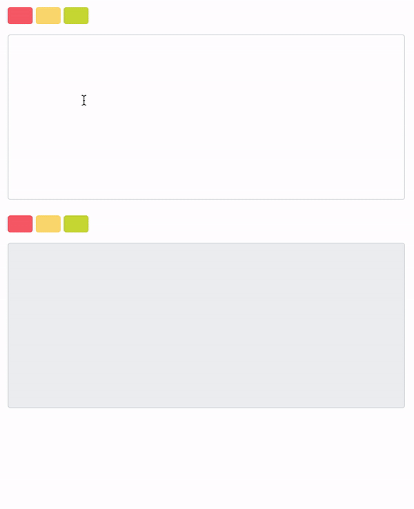

# WAES Assignment
WAES technical assignment

This project was bootstrapped with [Create React App](https://github.com/facebook/create-react-app).

You’ll need to have `Node 8.16.0` or `Node 10.16.0` or later version on your local development machine (but it’s not required on the server).

## Quick Overview

```sh
git clone https://github.com/ursulacervantes/waes.git
cd waes
yarn start
```

## Available Scripts

In the project directory, you can run:

### `npm start` or `yarn start`

Runs the app in the development mode.<br>
Open [http://localhost:3000](http://localhost:3000) to view it in the browser.

### `npm test` or `yarn test`

Launches the test runner in the interactive watch mode.<br>
See the section about [running tests](https://facebook.github.io/create-react-app/docs/running-tests) for more information.

### `npm run build` or `yarn build`

Builds the app for production to the `build` folder.<br>
It correctly bundles React in production mode and optimizes the build for the best performance.

The build is minified and the filenames include the hashes.<br>
Your app is ready to be deployed!


## Demo



## Components

Following components were used in this app

```
components
├── ColorPicker
├── TextEditor
│   ├── ColorPicker
│   ├── textarea
├── TextFilter
│   ├── ColorPicker
│   ├── div
├── App
│   ├── TextEditor
│   ├── TextFilter

```

## Data Structure
- **Hash Table:** Used to store text by color. Every color contains another map using pos as key and text as value. That way we keep the text list sorted with highly efficient look up.

- **Binary Indexed Tree:** Since we are using a backdrop div where we add the tag `<mark>`, we need to maintain current index of generated text.

```sh
Example of highlighted text
```

```sh
Example of <mark class="red">highlighted</mark> text
```

Every time that a substring is highlighted, the index on the generated text will change. Using Binary Indexed Tree we can obtain the new index in O(log n) and use less space than other data structures.

## Assumptions

- Once the text is updated, previous highlights are removed
- Any substring can be highlighted with **only** one color

## Future Improvements

- Update `highlights div` scroll position
- Remove highlighted text
- Highlight partial word with two colors
- Edit text and keep previous highlighted text
